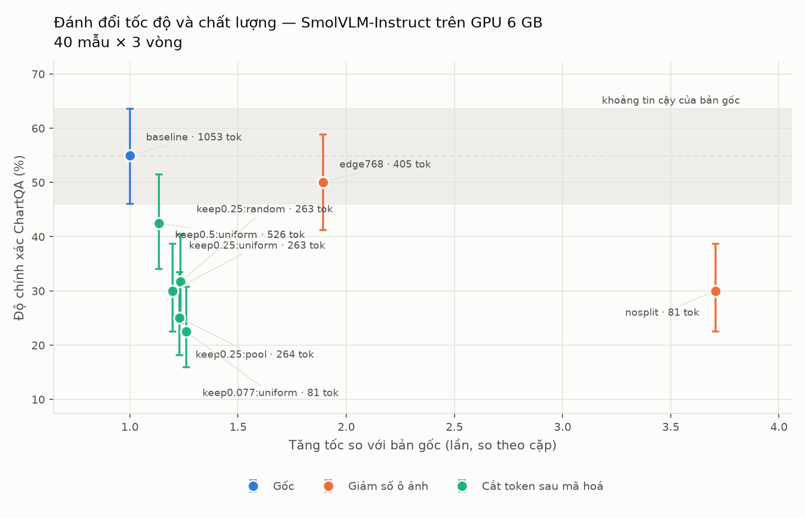

<div align="center">

# vlm-speedrun

**Running a vision-language model on a 6 GB GPU: where the time actually goes, and which levers are worth pulling**

</div>

---

## Result in one paragraph

> On a 6 GB laptop GPU, **the vision encoder takes 52.7% of the time**, while the
> language model — processing more than a thousand image tokens — takes only 29.3%.
> That is why **pruning image tokens after encoding, the most discussed technique,
> reaches only 1.13–1.26×**, whereas **halving the input resolution reaches 1.93×
> and doubles serving throughput**, at a cost of 7.3 accuracy points. nf4
> quantisation **cuts memory by 55%**, but is 8% slower and shows signs of losing
> about 4 points (p = 0.081) — with bitsandbytes, quantisation buys memory, not
> speed.



*The figure comes from the 40-sample × 3-round sweep — the only run containing both
lever families on the same samples. Its error bars are 95% Wilson intervals with
n = 40: the three rounds repeat the same questions and give the same verdicts, so they
add no information about accuracy. The main numbers in the tables below use up to 300
samples; the "Samples" column states each row's sample size.*

## Reproduce everything with one command

```bash
./speedrun.sh            # full run, about 45–60 minutes
FAST=1 ./speedrun.sh     # reduced run to check the pipeline, about 6 minutes
pixi run test            # 38 tests in a light CPU environment, a few seconds
```

The inference server runs in Docker:

```bash
docker build -t vlm-speedrun .
docker run --gpus all -p 50051:50051 -v ~/.cache/huggingface:/models vlm-speedrun
```

`--gpus all` needs the NVIDIA Container Toolkit when the Docker engine runs inside
WSL (Docker Desktop does not). Measured in a GPU container with the same parameters
as the native run:

| Longest edge | Native | In Docker | Difference |
|---:|---:|---:|---:|
| 768 | 503 ms · 2.02 req/s | 517 ms · 1.95 req/s | +3% |
| 1536 | 939 ms · 1.03 req/s | 1,020 ms · 0.96 req/s | +9% |

Both differences are below the 13.2% noise threshold, so Docker cannot be said to be
slower. Without a GPU the server runs with `--device cpu` (256M model: about
15 seconds per request).

Hardware: **NVIDIA RTX 1000 Ada Laptop, 6 GB, compute capability 8.9**, under WSL2.
No cloud GPU, no API spend.
Model: **SmolVLM-2.2B**. Data: **ChartQA** (scored with *relaxed accuracy*) and
**DocVQA** (scored with *ANLS*, used for the sanity check).

---

## Results

### Where the time goes

| Component | Time | Share |
|---|---:|---:|
| **Vision encoder** | 453 ms | **52.7%** |
| Connector | 2.6 ms | 0.3% |
| Language-model prefill | 252 ms | 29.3% |
| Generating the answer (up to 32 tokens; answers end after about 6) | 142 ms | 16.5% |
| *(CPU-side image preprocessing)* | *29 ms* | *3%* |

An 800×557 image is split into **13 tiles** and yields **1,053 image tokens** — 84%
of the entire input sequence.

### Levers that reduce image tokens

The p column is a paired McNemar test against the baseline.

| Configuration | Image tokens | Accuracy | Δ | p | Speedup | Samples |
|---|---:|---|---:|---:|---:|---:|
| Baseline (13 tiles, edge 1536) | 1,053 | 64.7% | — | — | 1.00× | 300 |
| **Longest edge reduced to 768** | 405 | 57.3% | −7.3 | **0.002** | **1.93×** | 300 |
| Single tile, no splitting | 81 | 41.0% | −28.0 | <0.0001 | 2.08× | 100 |
| Prune to 50% of tokens, uniform | 526 | 42.5% | −12.5 | — | 1.13× | 40 |
| Prune to 25%, uniform | 263 | 30.0% | −25.0 | — | 1.20× | 40 |
| Prune to 25%, **random** | 263 | 31.7% | −23.3 | — | 1.23× | 40 |
| Prune to 25%, mean pooling | 264 | 25.0% | −30.0 | — | 1.23× | 40 |

Each row is paired against the baseline **of its own run** (40 samples: 55.0%;
100 samples: 69.0%; 300 samples: 64.7%), so the Δ column holds even though the
baseline varies with the sample set. The 40-sample rows should be read as trends
only. Speed is measured far more precisely than accuracy: every sample yields a
latency measurement, but only one bit of right or wrong.

Two conclusions:

- **Fewer tiles beats token pruning on both axes.** At the same 81 image tokens,
  "single tile" is 2.08× faster at 41.0% accuracy, while "prune to 7.7%" is only
  1.26× faster at 22.5%. Pruning after encoding still pays the full cost of the
  vision encoder.
- **Which tokens are kept does not matter, only how many.** Uniform selection scores
  30.0% and random selection 31.7% at the same token count — not distinguishable.
  The random control arm exists precisely to answer this question.

### Quantisation

| Mode | Latency | Peak VRAM | Top-1 agreement | Max logit difference |
|---|---:|---:|---:|---:|
| bf16 (reference) | 907 ms | 4,805 MB | 100% | 0 |
| fp16 | 927 ms | 4,805 MB | 100% | 5.97 |
| int8 | **2,340 ms** | 3,008 MB | 100% | 3.16 |
| **nf4** | 922 ms | **1,905 MB** | 100% | 6.78 |

**bitsandbytes quantisation buys memory here, not speed.** Neither format reduces the
arithmetic, and each adds work:

- **int8** (LLM.int8) quantises the activations on every call, splits out outlier
  features into a separate fp16 matrix multiplication, then dequantises and merges the
  two results. That extra work makes it 2.6× slower.
- **nf4** only quantises the weights, so every call first dequantises them back to
  bf16. In the vision encoder and the prefill, which are compute-bound and take about
  80% of the time, that is pure overhead. In decoding, the 4-bit kernel does cut GPU
  time per token roughly in half, but a decoding step launches about a thousand small
  kernels. Once the GPU work shrinks below the CPU time needed to launch them, the
  GPU waits for the CPU and the saving disappears.

Quantisation that targets this workload's bottleneck would quantise activations too
(W8A8 or FP8, which this Ada GPU supports) with fused kernels. That was not tested
here.

nf4 measured in depth on **300 samples**, paired against bf16 on the same samples:

| | bf16 | nf4 | Difference |
|---|---:|---:|---|
| Accuracy (baseline) | 64.7% | 60.7% | −4.0 points, **p = 0.081** |
| Accuracy (edge 768) | 57.3% | 54.3% | −3.0 points, p = 0.200 |
| Latency | 995 ms | 1,081 ms | **8% slower** |
| Peak VRAM | 5,213 MB | **2,321 MB** | **−55%** |

At p = 0.081 the evidence falls short of the 0.05 threshold, but only just — so the
accurate statement is *"signs of losing about 4 points"*, not *"no effect"*.

### Serving over gRPC

| Longest edge | Concurrency | Median | p95 | Throughput |
|---:|---:|---:|---:|---:|
| 1536 | 1 | 939 ms | 1,201 ms | 1.03 req/s |
| 1536 | 2 | 1,931 ms | 2,442 ms | 1.02 req/s |
| 1536 | 4 | 3,848 ms | 4,342 ms | 1.01 req/s |
| **768** | 1 | **503 ms** | 635 ms | **2.02 req/s** |
| 768 | 2 | 993 ms | 1,111 ms | 1.99 req/s |
| 768 | 4 | 1,927 ms | 2,111 ms | 1.99 req/s |

Server-side compute time is **flat across concurrency levels**; everything added is
queue wait. One GPU serves one request at a time, so **raising concurrency does not
raise throughput, it only inflates latency**. Reducing the resolution doubles
throughput, exactly as the offline measurements predicted.

### Sanity check on DocVQA

If the pipeline had a systematic fault — in prompting, scoring or preprocessing —
every result above would be suspect. The check: run DocVQA's exact **ANLS** metric
and compare with the number published by the model's authors.

| | ANLS |
|---|---:|
| This project (100 samples, validation split) | **73.8** |
| Published by the SmolVLM authors (full test split) | 81.6 |

A 7.8-point gap is consistent with the difference in split and sample size, so
**there is no systematic fault**. A measurement project needs this check: it confirms
that the whole apparatus measures what it is meant to measure.

### Does the instruction language matter

The instruction appended to every question is in Vietnamese, while both datasets are
in English. That is a reasonable suspicion, so it was measured rather than assumed:

| Dataset | Vietnamese instruction | English instruction | Verdict |
|---|---:|---:|---|
| ChartQA (200 samples, paired) | 67.0% | 66.0% | p = 0.80 — not distinguishable |
| DocVQA (100 samples, paired) | 73.8 ANLS | 76.7 ANLS | p = 0.27 — not distinguishable |

The 2.9-point DocVQA gap looks meaningful but rests on only **13 discordant
samples**, so it does not hold up. Instruction language is not an important variable
here. The Vietnamese instruction remains the default so that every recorded result
stays reproducible; `prompten` in the harness switches to the English one.

---

## Six measurement rules, enforced in code

Performance measurement on a laptop GPU easily produces results that are wrong in
your own favour. These rules live in `bench/harness.py`, not in a document:

1. **The timed region covers the whole real path**, in every configuration compared
2. **Rounds are replicates over the same sample set**, so comparisons can be paired
3. **Configurations are interleaved and shuffled**, with a seed for reproducibility
4. **Report the median and interquartile range**, never mean ± standard deviation
5. **Only claim an improvement above three times the measured noise** — 13.2% for the 2.2B model on this machine (CV 4.4%)
6. **Record invariants and machine state** with every measurement (image tokens, clocks, temperature)

## Measurement mistakes made along the way

Recorded because every one of them **made the results look better or more certain
than they were** — exactly the kind of error that does not reveal itself. The last two
were found later, while writing the study notes, and are fixed in the code.

| Mistake | Symptom | Consequence if missed |
|---|---|---|
| Vision encoder outside the timed region on the optimised path | reported **3.47×** | the real number is **1.12×**, inflated threefold |
| Each round used a different group of samples | IQR 86.5%, "drift −44%" | spread caused by image size was misread as system noise |
| Concluding "no difference" from 100 samples | p = 0.18 | with 300 samples the same effect gives p = 0.002 — **the conclusion reverses** |
| Forgot `--model`, silently ran the 256M model | accuracy 23%, 640 image tokens | nearly concluded that 4-bit quantisation breaks the model |
| Confidence intervals counted every round as a new sample | error bars about √3 too narrow | results looked more certain than 40 questions allow |
| Noise threshold measured on the 256M model, then its file overwritten by a quick run | threshold 25.5% instead of 13.2% | real improvements of 13–25% would have been dismissed |

The fourth leaves a lesson of its own: **the image-token count is invariant** to the
numeric format. When it changes, you are measuring something other than what you
think. The last two share one: **n is the number of independent observations, not the
number of rows in a file**, and every constant used for a decision must be measured
under the conditions it is used in. Quick pipeline checks (`FAST=1`) now write to
`results/fast/` so they can no longer overwrite reference results.

---

## Layout

```
bench/
  latency_probe.py     latency, and the NOISE of the measurement itself
  breakdown.py         breakdown: vision · connector · prefill · decode
  preprocess_cost.py   CPU-side image preprocessing cost
  prune.py             image-token pruning after the connector (4 selection methods)
  quantize.py          bf16/fp16/int8/nf4 with a logit equivalence check
  harness.py           main harness: accuracy + latency across configurations
  metrics.py           relaxed accuracy · Wilson interval · McNemar · ANLS
  analyze.py           paired analysis within one run
  compare_runs.py      paired comparison across two separate runs
  sanity_docvqa.py     DocVQA check against the published score
  plot.py              trade-off figure (light and dark variants)
serve/
  vlm.proto            gRPC interface
  gen_proto.py         generates code from vlm.proto (runs automatically when missing)
  server.py            inference server with a queue and graceful degradation
  client_bench.py      end-to-end latency at several concurrency levels
tests/                 38 tests for the core, on CPU in a few seconds
results/               raw JSON results + figures
speedrun.sh            one command to rerun everything
Dockerfile             packages the inference server
```

## Limitations

- One model, one benchmark family, one GPU. Nothing is claimed for other setups.
- The laptop GPU clocks cannot be locked (`nvidia-smi` reports active power and
  thermal capping), so a baseline noise of about 4.4% (CV) is unavoidable.
- Quantisation was tested only through bitsandbytes (weight-only nf4 and LLM.int8).
  Activation quantisation (W8A8, FP8), CUDA graphs and fused 4-bit kernels, which
  target the bottlenecks found here, were not.
- The SmolVLM authors do not publish a ChartQA score, so the main benchmark has no
  independent reference number; the DocVQA check above is the substitute.
- Token pruning was tried with four simple selection methods only; attention-based
  selection such as FastV, which requires deeper changes to the model's decoding
  loop, was not.

## References

- **SmolVLM** (Hugging Face) — the model used in the experiments
- **ChartQA** — dataset and the *relaxed accuracy* metric
- **DocVQA** — dataset and the *ANLS* metric
- **FastV**, **ToMe** — image-token pruning and merging techniques
- **bitsandbytes** — int8 and nf4 quantisation
